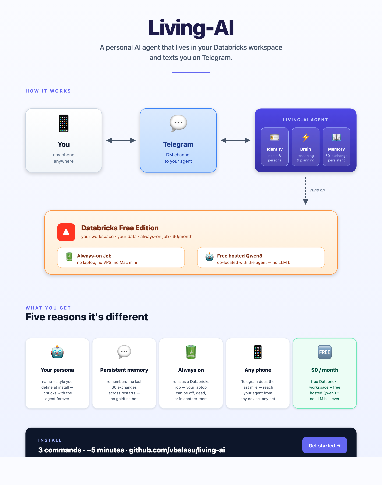

# Living-AI

An autonomous AI agent that lives in your Databricks workspace and chats with
you on Telegram. Runs free on Databricks Free Edition — uses an open-source
LLM (Qwen 3) hosted by Databricks, so no LLM bills. Remembers the last 60
exchanges across restarts.



### ▶️ Watch the 2-minute demo

[](https://youtu.be/D6cVKe2nQZc)

**[▶️ Click here to watch on YouTube](https://youtu.be/D6cVKe2nQZc)**

## Quickstart (3 steps)

### 1. Download

Click the link below and save `living-ai-deploy.pex` somewhere you can find
it (your Desktop or Downloads folder is fine).

**[⬇ Download living-ai-deploy.pex](https://github.com/vbalasu/living-ai/raw/main/living-ai-deploy.pex)**

### 2. Install

Open a terminal in the folder where you saved the file and run:

**macOS or Linux:**
```bash
chmod +x living-ai-deploy.pex
./living-ai-deploy.pex
```

**Windows:** the installer requires WSL2 (Windows Subsystem for Linux). One-time setup:
1. Open PowerShell as Administrator and run `wsl --install` (creates an Ubuntu environment, takes ~5 minutes; reboot when prompted)
2. Open the **Ubuntu** app from the Start menu
3. In the Ubuntu terminal, install Python (the installer will offer to install Databricks CLI for you):
   ```bash
   sudo apt update && sudo apt install -y python3 curl
   ```
4. Move the downloaded file into your WSL home directory and run it (the WSL `/mnt/c/...` mount doesn't honor `chmod +x`):
   ```bash
   mv /mnt/c/Users/<your-windows-username>/Downloads/living-ai-deploy.pex ~/
   cd ~ && chmod +x living-ai-deploy.pex && ./living-ai-deploy.pex
   ```

The installer will ask you three short rounds of questions (your Databricks
workspace, your Telegram bot, your agent's name). Each prompt explains what
it's asking and why. Defaults are filled in for everything else — just press
ENTER to accept.

### 3. Chat

When the installer finishes, it prints a `https://t.me/<your-bot>` link. Open
it in Telegram, tap **Start**, and DM your agent. It replies in seconds.

---

## What you'll need

Before running the installer, have these ready:

| Thing                         | How to get it                                                                                                |
| ----------------------------- | ------------------------------------------------------------------------------------------------------------ |
| Databricks workspace          | **Sign up free in ~2 minutes** at <https://www.databricks.com/learn/free-edition> — no credit card           |
| Databricks personal token     | In your workspace: avatar (top-right) → Settings → Developer → Access tokens → **Generate new token**       |
| Telegram bot token            | DM [@BotFather](https://t.me/BotFather), send `/newbot`, follow prompts (~30 seconds)                        |
| Your Telegram username        | Telegram → tap menu (≡) → tap your name at top → look for **Username** (set one if you don't have it yet)    |

The installer also needs Python 3.11+ and the Databricks CLI installed locally.
**You don't need to install Databricks CLI yourself — the installer will offer
to install it for you on first run.** If you'd rather install it ahead of time:

| Tool             | macOS                                            | Linux / WSL Ubuntu                                                                                  |
| ---------------- | ------------------------------------------------ | --------------------------------------------------------------------------------------------------- |
| Python 3.11+     | `brew install python@3.11`                       | usually preinstalled; else `sudo apt install python3`                                               |
| Databricks CLI   | `brew tap databricks/tap && brew install databricks` | `curl -fsSL https://raw.githubusercontent.com/databricks/setup-cli/main/install.sh \| sudo sh` |

---

## Want the full reference?

[INSTALL_GUIDE.md](./INSTALL_GUIDE.md) — every flag, advanced options, troubleshooting, uninstall, switching LLMs (OpenAI / Anthropic / Bedrock via external models), and rebuilding the deployer.
